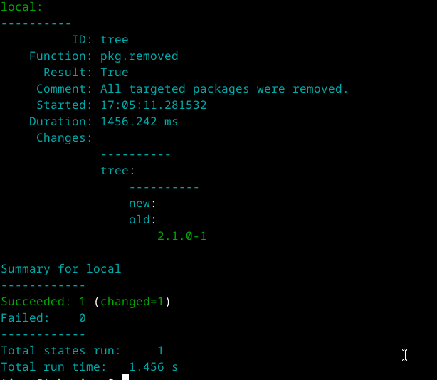
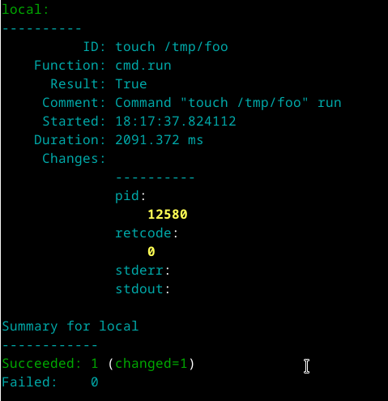

## h1 Viisikko
Tämä raportti on kirjoitettu 31.3.2025 klo. 15.00 - 19.40 välisenä aikana.

Raportissa on tehty Tero Karvisen Palvelinten Hallinta kurrsin tehtäviä, jotka löytyvät materiaaleineen sivustolta: (https://terokarvinen.com/palvelinten-hallinta/)

Käytetty laitteisto:

Isäntäkone:

* Malli: Msi GE75 Raider 10sf
* OS: Windows 10 Home 64-bit
* RAM: 16 GB
* CPU: Intel(R) Core(TM) i7-10750H CPU @ 2.60GHz (12 CPUs), ~2.6GHz
* GPU: NVIDIA GeForce RTX 2070
* BIOS: E17E9IMS, 10A

Virtuaalikone:
* OS: Debian/GNU Linux 12 (bookworm) x84_64
* RAM: 4 GB
* CPU: 2 processor
* GPU: 128 MB

### Tiivistelmä
#### Run Salt Command Locally

* $ sudo salt-call --version - Tarkistetaan asennettu saltin versio

 "$ sudo salt-call --local -l info state.single" + "pkg" "file" "service" "user" "cmd"
 
* $ sudo salt-call --local -l info state.single pkg.installed "Ohjelma" - Asentaa ohjelman
* ...pkg.removed <Ohjelma> - Poistaa ohjelman
* ...file.managed /"Polku"/"Tiedosto" - muokkaa tiedostoa
* ...file.absent /"Polku"/"Tiedosto" - poistaa tiedoston
* ...service.running "Demoni" enable=True - käynnistää demonin
* ...service.dead "Demoni" enable=False - sulkee demonin
* ...user.present "User" - lisää käyttäjän
* ...user.absent "User" - poistaa käyttäjän
* ...cmd.run "Komento" - ajaa komennon

#### Salt Quick Start

* sudo apt-get -y install salt-master - asennetaan isäntä koneelle.
* hostname -I - Näkee IP-osoitteen, orjan täytyy tietää kuka isäntä on
* 4505/tcp and 4506/tcp porttien täytyy olla auki isännällä, jos palomuuri käytössä.
* slave$ sudoedit /etc/salt/minion - "master=IP, id=orja"
* slave$ sudo systemctl restart salt-minion.service - demoneita pitää potkia, kun muutoksia tehdään.
* master$ sudo salt-key -A - nähdään ketä haluaa orjaksi ja hyväksytään.

#### Raportin Kirjoittaminen

* Raportin täytyy olla toistettavissa sekä täsmällinen.
* Raportin täytyy olla helppolukuinen.
* Raportissa täytyy olla lähdeviittaukset.
* Vilppiä ei saa harrastaa.

#### Salt Install Guide: Linux(DEB)

Saltin asennus

##### 1 askel

* mkdir -p /etc/apt/keyrings - Tekee "keyrings" hakemiston 
* curl -fsSL https://packages.broadcom.com/artifactory/api/security/keypair/SaltProjectKey/public | sudo tee /etc/apt/keyrings/salt-archive-keyring.pgp - Hakee julkisen avaimen
* curl -fsSL https://github.com/saltstack/salt-install-guide/releases/latest/download/salt.sources | sudo tee /etc/apt/sources.list.d/salt.sources - Tekee repon

##### 2 askel

* sudp apt update - päivittää metadatan

##### 3 askel

* sudo apt-get install salt-minion - asentaa salt-minionin (orjan)

## b) Salt-minion
Tehtävän aloitus kello 15.00

Avasin saltin asennus ohjeet: (https://docs.saltproject.io/salt/install-guide/en/latest/topics/install-by-operating-system/linux-deb.html)

Asensin paketit komennoilla:

#### Komento: "mkdir -p /etc/apt/keyrings" 

Teki hakemiston "keyrings" polkuun "/etc/apt/keyrings/"

keyrings hakemisto löytyy.
  
#### Komento: "curl -fsSL https://packages.broadcom.com/artifactory/api/security/keypair/SaltProjectKey/public | sudo tee /etc/apt/keyrings/salt-archive-keyring.pgp" 

Jos oikein ymmärrän, niin komento tarkastelee linkkiä ja "tee" komennolla vie linkin datan keyrings hakemistoon tiedostoksi "salt-archieve-keyring.pgp"

Näyttäisi näin käyneen.

#### Komento: "curl -fsSL https://github.com/saltstack/salt-install-guide/releases/latest/download/salt.sources | sudo tee /etc/apt/sources.list.d/salt.sources" 

Sama toistuu, eli linkin takana olevat tiedot viedään hakemistoon tiedostoksi "salt.sources"

   
Seuraavaksi yritin asentaa salt-minionin komennolla "sudo apt-get install -y salt-minion"

Ei onnistunut, pakettien kanssa jotain häiriötä. Olin unohtanut vaiheen 2 asennus ohjeesta. Eli pakettien päivityksen. Komennolla "sudo apt update" paketit päivitettiin ja tämän jälkeen kokeilin uudestaan salt-minionin asentamista ja se toimi. Tarkistus komennolla "sudo salt-call --version"

Valmis 16.00

## c) Viisi Tärkeintä

Aloitettu 16.30

### pkg.installed/removed

pkg on paketinhallintaa, eli tämän avulla asennetaan ja poistetaan ohjelmistoja.

#### Komennolla: "sudo salt-call --local -l info state.single pkg.installed tree" 

salt tarkistaa, että onko ohjelma "tree" asennettu. Jos ei ole, niin salt asentaa kyseisen ohjelman.

Kuvasta näkee, että pakettia ei aiemmin ole ollut ja tämä on asentunut onnistueensti. Ajamalla komennon uudestaan ei pitäisi tulla muutoksia.

Koska paketti on jo asennettuna, niin muutoksia ei tarvitse tehdä ja tila on haluttu niin lopputulos on onnistunut.

#### Komenolla: "sudo salt-call --local -l info state.single pkg.removed tree"

Salt tarkistaa, ettei pakettia "tree" ole olemassa, jos on niin tämä poistetaan.

Ja näin kävi, eli "tree" poistettiin.

### file.managed/absent

Tiedoston hallintaa, muokataan tekstitiedostoja.

#### Komento: "sudo salt-call --local -l info state.single file.managed /tmp/testi"

Tarkistaa, että onko "testi" nimistä tiedostoa olemassa hakemistossa "/tmp/", jos ei niin luodaan tiedosto sinne.

Muutoksia tehty onnistuneesti.

"/tmp/" hakemistosta löytyy "testi" niminen tiedosto.

#### Komento: 'sudo salt-call --local -l info state.single file.managed /tmp/testi contents="uurgh"'

Lisää juuri tehtyyn tiedostoon rivin "uurgh"

#### Komento: "sudo salt-call --local -l info state.single file.absent /tmp/testi"

Tarkistaa, ettei tiedostoa "testi" löydy "/tmp/" hakemistosta. Jos löytyy niin se poistetaan.

Tiedosto "testi" ei enää ole "/tmp/" hakemistossa.

### service.running/dead

Demonien hallintaa

#### Komennolla: "sudo salt-call --local -l info state.single service.running apache2 enable=True"

Tarkistetaan, että apache2 on päällä ja, jos ei niin käynnistetään?

Päätelmäni on oikein sillä apache2 ei ole asennettuna, niin sitä ei voi käynnistää.

Komennon "sudo salt-call --local -l info state.single pkg.installed apache2" Pitäisi tarkistaa, että onko apache2 asennettuna, jos ei niin asennetaan. Ajoin komennon ja kokeilin service komentoa uudestaan.

Apachen asennus näyttäisi onnistuneen.

Apache2 on päällä. Service komento toimii.

#### Komennolla "sudo salt-call --local -l info state.single service.dead apache2 enable=False" 

"Tapetaan" demoni. Käytännössä tarkoittaa sitä, että palvelu suljetaan. 

### user.present/absent

Halittaan käyttäjiä

#### Komenolla "sudo salt-call --local -l info state.single user.present timor"

Tarkistetaan, että käyttäjä timor on olemassa, jos ei niin lisätään.

Käyttäjä timor lisätty.

#### Komennolla "sudo salt-call --local -l info state.single user.absent timor"

Tarkistetaan ettei käyttäjää timor ole olemassa, jos on niin poistetaan.

Käyttäjä timor poistettu

### cmd.run

Ajetaan komentoja

#### Komennolla 'sudo salt-call --local -l info state.single cmd.run 'touch /tmp/foo' creates="/tmp/foo"'

Ajetaan "touch" komento, mikä tekee "foo" tiedoston "/tmp/" hakemistoon.

Touch komento Linux.fi:n mukaan päivittää tiedostojen aikaleimat nykyhetkeen muuttamatta näiden sisältöä. Touch komennolla voi myös luoda uusia tiedostoja anatamalla nimi, jota ei ole.

Komento teki "foo" tiedoston.

Lopetettu 18.00

## d) Idempotentti

Aloitettu klo. 19.15

Eli tässä halutaan muuttumaton tila vaikka, jokin asia toistettaisiin useasti.

Ajoin komennon 'sudo salt-call --local -l info state.single cmd.run 'touch /tmp/foo' creates="/tmp/foo"' uudestaan.

Voidaan nähdä, että idempotenssi on saavutettu, kun mitään muutosta ei tapahtunut. Komento suoritettiin onnistuneesti, ja kun komennon tavoite on jo olemassa, niin muutoksia ei tarvita joten tila on harmoninen. Voin siis ajaa komennon saaden aina saman vastauksen.

Lopetettu klo. 19.30

## Lähteet:

Karvinen, Tero 2025: Palvelinten Hallinta: (https://terokarvinen.com/palvelinten-hallinta/) Luettu 31.3.2025

Karvinen, Tero 2018: Salt Quickstart - Salt Stack Master and Slave on Ubuntu Linux: (https://terokarvinen.com/2018/03/28/salt-quickstart-salt-stack-master-and-slave-on-ubuntu-linux/) Luettu 31.3.2025

Karvinen, Tero 2006: Raportin Kirjoittaminen: (https://terokarvinen.com/2006/06/04/raportin-kirjoittaminen-4/) Luettu 31.3.2025

Karvinen, Tero 2023: Run Salt Command Locally: (https://terokarvinen.com/2021/salt-run-command-locally/) Luettu 31.3.2025

Salt Project, Salt Install Guide: Linux (DEB): (https://docs.saltproject.io/salt/install-guide/en/latest/topics/install-by-operating-system/linux-deb.html) Luettu 31.3.2025

Linux.fi 2020: Touch: (https://www.linux.fi/wiki/Touch) Luettu 31.3.2025
