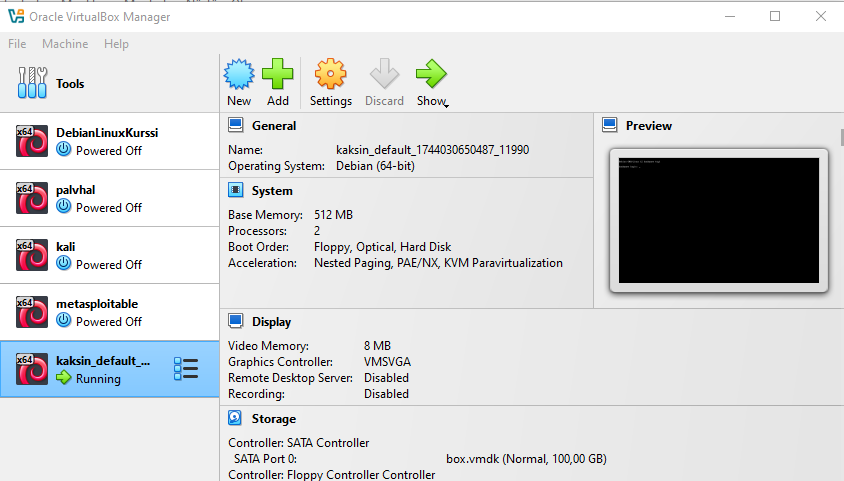

# h2 Soitto Kotiin

Tämä raportti on kirjoitettu 7.4.2025 - 8.4.2025 klo. 14.00 - 00.30 välisenä aikana.

Raportissa on tehty Tero Karvisen Palvelinten Hallinta kurrsin tehtäviä, jotka löytyvät materiaaleineen sivustolta: (https://terokarvinen.com/palvelinten-hallinta/)

Käytetty laitteisto:

Isäntäkone:

* Malli: Msi GE75 Raider 10sf
* OS: Windows 10 Home 64-bit
* RAM: 16 GB
* CPU: Intel(R) Core(TM) i7-10750H CPU @ 2.60GHz (12 CPUs), ~2.6GHz
* GPU: NVIDIA GeForce RTX 2070
* BIOS: E17E9IMS, 10A

## x) tiiviste

### Two Machine Virtual Network With Debian 11 Bullseye and Vagrant

Debianilla tai ubuntulla vagrantin asennus:

* $ sudo apt-get update
* $ sudo apt-get install vagrant virtualbox

Koneelle t001 kirjaudutaan vagrantilla:

* vagrant ssh t001

Palataan takaisin isäntä käyttikselle:

* exit

Vagrantilla tehdyt koneet tuhotaan:

* vagrant destroy

### Salt Vagrant - automatically provision one master and two slaves

Koneiden käynnistys:

* vagrant up

Orjien hyväksyntä:

* sudo salt-key -A

Yhteys orjiin testataan:

* sudo salt '*' test.ping

### Salt Quickstart – Salt Stack Master and Slave on Ubuntu Linux

Asennetaan master koneelle:

* sudo apt-get -y install salt-master

Asennetaan orja koneille:

* sudo apt-get -y install salt-minion

Tarkistetaan ketä ollaan:

* hostname -I

Master koneella täytyy avata reiät tulimuuriin (jos käytössä) salttia varten portteihin:
* 4505/tcp
* 4506/tcp

Minion tiedostoa voidaan muokata komennolla

* slave$ sudoedit /etc/salt/minion

minion tiedostosta pitää löytyä:

* master: osoite

minion tiedostossa orjalle voi antaa nimen

* id: nimi

Komennolla:

* sudo salt '*' cmd.run 'whoami' - voidaan tarkastaa orjat.

## a) Hello vagrant!

Latasin vagrantin sivustolta: (https://developer.hashicorp.com/vagrant/install)

Valitsin seuraavan version, koska käytän windowsia.

Asensin ohjelman ajamalla tämän tuplaklikkaamalla installer-kuvaketta. Asennuksen jälkeen käynnistin koneen uudeestaan.

Windowsin komentotulkissa komennolla "vagrant version" pystyi tarkistamaan, että onko vagrant asennettuna. (Vagrantin dokumentaatiot löytyvät osoitteesta: https://developer.hashicorp.com/vagrant/docs)

Näyttäisi olevan.

## b) Vagrantilla uusi linux virtuaalikone

Lueskelin Antti Salmisen raporttia: (https://oispadotka.wordpress.com/2020/05/12/h6/) ja lähdin kokeilemaan.

Käytin komentoa "vagrant box add hashicorp/bionic64", mikä asensi kehitysympäristön. Jos oikein olen ymmärtänyt, niin tämä asensi asetukset bionic64 käyttöjärjestelmää varten. Tämä on Stephen Jenningsin mukaan Ubuntu 18.04 versio. Eli en uskoakseni olisi tarvinnut tätä asennusta, koska aion käyttää debiania. Tämän lisäksi asensin boxin C-asemalle, minne tätä en halua.

Tein tässä vaiheessa uuden hakemiston D-asemalle ja navigoin komentutulkissa tänne. Tänne aion siis asentaa vagrantilla virtuaalikoneita. Kokeilin Karvisen sivulta löytyvää "init debian/bookworm64" komentoa, minkä pitäisi virtuaalikone alustaa.

Tämä onnistui eli nyt on vagrantfile ja pitäisi pystyä virtuaalikone käynnistämään komennolla "vagrant up".

Boxia debian/bookworm64 ei löydy, mutta vagrant automaattisesti tämän boxin haki ja asensi, mikä teki aikaisemmasta boxin lisäämisestä todellakin turhan.

Virtuaalikone asennettu ja näyttää pyörivän.

## c) Kaksin kaunihimpi

Poistin aikaisemmin tekemäni virtuaalikoneen komennolla: "vagrant destroy".  Komento ei kuitenkaan vagranfileä poistanu, joten tätä ei tarvinnut erikseen luoda uudestaan. Seuraavaksi pähkäilin, että miten saan vagrantfileä konfiguroimalla tehtyä 2 virtuaalikonetta kerralla.

Karvisen materiaaleista (osoitteesta: https://terokarvinen.com/2021/two-machine-virtual-network-with-debian-11-bullseye-and-vagrant/) löytyikin vagrantfilen pohja millä saa kaksi virtuaalikonetta luotua. 

Jos osaan vagranfileä oikein tulkita, niin tämä tekee koneet t001 ja t002. Asettaa näille osoitteet "192.168.88.101" ja "192.168.88.102". Sekä ajaa scriptin, mikä suorittaa komennot:
* "set -o verbose" - Windows server docsien mukaan komento tekee seuraavan: Turns on verbose output logging during the shadow copy creation process. If verbose mode is on, set provides details of writer inclusion or exclusion and details of metadata compression and extraction. (https://github.com/MicrosoftDocs/windowsserverdocs/blob/main/WindowsServerDocs/administration/windows-commands/set-verbose.md)
* "apt-get update" - hakee paketeille päivitykset
* "apt-get -y install tree" - asentaa tree paketin
* 'echo "Done - set up test environment - https://terokarvinen.com/search/?q=vagrant"' - tulostaa viestin

Oletan, että scriptit ajetaan koneiden sisällä.

Muokkasin vagranfilestä aluksi riviä 'config.vm.box = "debian/bullseye64"' seuraavasti  'config.vm.box = "debian/bookworm64"' Koska bookworm on tutumpi. Eli virtuaalikoneet asentuvat debian bookworm ympäristöön bullseyen sijaan.

Sitten kokeilin "vagrant up" komentoa.

Sehän toimi ja koneet t001 ja t002 tehtiin debian/bookworm64 alustaa käyttäen. Paketit päivitettiin ja tree asennettiin sekä echolla myös viesti tulostettiin. Scriptiin voisi ehkä lisätä rivit "sudo apt-get -y install ufw" ja "sudo ufw enable" millä palomuuri asentuisi ja tulisi käyttöön koneille. Ja juuri tässä järjestyksessä, eli ensiksi asennetaan sitten otetaan käyttöön. 

Komennolla "vagrant ssh t001" kirjauidin t001 koneelle ja komennolla "ip addr" sain selville, että ip-osoite on yllättäen "192.168.88.101". "Exit komennolla kirjauduin ulos. Tarkistin myös t002 koneen ip:n (192.168.88.102) ja sitten pingasin t002 koneelta t001 koneen osoitetta komennolla "$ ping 192.168.88.101"

Koneet keskustelevat keskenään.

## d) herra-orja

Aloitin tuhoamalla virtaalikoneet käyttäen komentoa "vagrant destroy".

Seuraavaksi muokkasin vagrantfileä seuraavasti

Eli lisäsin palomuurin asennuksen ja käyttöön oton ja nimesin ensimmäisen koneen masteriksi sekä toisen koneen s001:ksi.

Sitten taast ajamaan komentoa "vagrant up". Epäonnistuin, sillä unohdin tallentaa vagrantfileen tehdyt muutokset. Vagrantti lähti siis ajamaan vagrantfileä aiemmilla konfiguraatioilla, eli "t001 ja t002 jne.."

Uusi yritys tallennuksen jälkeen. Muuten näyttäisi onnistuneen, mutta palomuurin päälle laittaminen ei onnistuinut.

Seuraavaksi kirjauduin master koneelle ja pingasin s001 konetta sekä laitoin palomuurin päälle. Sitten avastin portit 4505/tcp ja 4506/tcp komennolla "sudo ufw allow 'portti'" Tämän jälkeen kävin laittamassa s001 koneelta palomuurin päälle. Sitten buuttasin koneet "vagrant halt" sammuttaa ja "vagrant up" käynnistää.

Palomuuri näytttäisi estävän vagrantilta pääsyn koneelle. Eli alusta. Tuhosin koneet ("vagrant destroy"). Muokkasin vagrantfileä siten, ettei koneet yritä käynnistää palomuuuria. Asesnsin koneet uudestaan ("vagrant up").

Muistaakseni ssh käyttää porttia 22, joten avasin kyseisen portin sekä portit 4505 ja 4506 master koneelta. Käynnistin palomuurin ja buuttasin koneet.

Näyttäisi toimivan, joten käynnistin koneelta s001 palomuurin ja avasin reiän 22, jotta ssh pääsee palomuurin ohi. Uudestaan buuttaus.

Kirjauduin master koneelle ja pingasin s001 konetta.

Näyttäisi toimivan, joten seuraavaksi asensin salt masterin. Tässä vaiheessa heräsi ajtus, että nämä salt-pakettien asennukset voisi kyllä viedä vagrantfileen. Päätin kokeilla mitä käy, jos vain asentaa salt-maseterin master koneelle ja salt-minionin s001 koneelle. Uskoisin, että homma ei toimi.

Pitkälle ei päästy, koska salt paketit puuttuvat. Sammutin koneet. Ja kävin päivittämässä vagrantfileä.

Lisäsin tiedostoon saltpakettien asennus komennot, näin tämän onnistuessa luottamussuhde on tehty. Seuraavaksi kokeilin komentoa "vagrant reload" komentoa minkä pitäisi uudeelleen käynnistää koneet samalla lataamalla uudet konfiguraatiot vagrantfilestä. Paketit eivät näin asentuneet. Kokeilen vielä "vagrant reload --provision" komentoa.

curl komentoa ei löydy, joten lisäsin vagranfileen curlin asennuksen "sudo apt-get install curl". Ja uudestaan "vagrant reload --provision" Sitten vielä -y, jotta hyväksytään kaikki turhat varmistelut. Tein saman palomuuri asetusten kohdalla. Sitten tajusinkin, että voinkin kirjoittaa vagrantfilen konekohtaisesti. Miksi säätää mitään manuaalisesti, kun voi kaiken automatisoida tjsp.

Elikkä yllä lopullinen vagrantfile. En saanut palomuuria automaattisesti käynnistettyä, koska en osannut ohittaa y/n promptia. Eli palomuurit täytyy käydä laittamassa päälle kirjautumalla koneille. Minkä jälkeen pitää buutata koneet, käytin komentoa "vagrant halt" ja tämän jälkeen "vagrant up".

Sitten master koneella kokeilemaan komentoa "sudo salt-key -A"

Näyttäisi toimivan. Jostain syystä tämä ei toiminut ennen, kuin koneet oltiin buutattu, vaikka "sudo systemctl restart salt-minion.service" komentoa käyttikin. Jokatapauksessa seuraavaksi ajoin master koneelta komennon "sudo salt '*' cmd.run 'whoami'".

Orjakone slave001 kertoo olevansa root. Eli tämä tehty.

Käyttämäni Vagrantfile:

    # -*- mode: ruby -*-
    # vi: set ft=ruby :
    # Copyright 2019-2021 Tero Karvinen http://TeroKarvinen.com
    $master = <<MASTER
    set -o verbose
    sudo apt-get update
    sudo apt-get install -y curl
    curl -fsSL https://packages.broadcom.com/artifactory/api/security/keypair/SaltProjectKey/public | sudo tee /etc/apt/keyrings/salt-archive-keyring.pgp
    curl -fsSL https://github.com/saltstack/salt-install-guide/releases/latest/download/salt.sources | sudo tee /etc/apt/sources.list.d/salt.sources
    sudo apt-get update
    sudo apt-get install -y ufw
    sudo ufw allow 22/tcp
    sudo ufw allow 4505/tcp
    sudo ufw allow 4506/tcp
    sudo apt-get install -y salt-master
    echo "Done - set up test environment - https://terokarvinen.com/search/?q=vagrant"
    MASTER

    $slave = <<SLAVE
    set -o verbose
    sudo apt-get update
    sudo apt-get -y install curl
    curl -fsSL https://packages.broadcom.com/artifactory/api/security/keypair/SaltProjectKey/public | sudo tee /etc/apt/keyrings/salt-archive-keyring.pgp
    curl -fsSL https://github.com/saltstack/salt-install-guide/releases/latest/download/salt.sources | sudo tee /etc/apt/sources.list.d/salt.sources
    sudo apt-get update
    sudo apt-get install -y ufw
    sudo ufw allow 22/tcp
    sudo apt-get install -y salt-minion
    sudo echo "master: 192.168.88.101" >> /etc/salt/minion
    sudo echo "id: slave001" >> /etc/salt/minion
    sudo systemctl restart salt-minion.service
    echo "Done - set up test environment - https://terokarvinen.com/search/?q=vagrant"
    SLAVE

    Vagrant.configure("2") do |config|
	    config.vm.synced_folder ".", "/vagrant", disabled: true
	    config.vm.synced_folder "shared/", "/home/vagrant/shared", create: true
	    config.vm.box = "debian/bookworm64"

	    config.vm.define "master" do |master|
		    master.vm.provision "shell", inline: $master
		    master.vm.hostname = "master"
		    master.vm.network "private_network", ip: "192.168.88.101"
	    end

	    config.vm.define "s001", primary: true do |s001|
		    s001.vm.provision "shell", inline: $slave
		    s001.vm.hostname = "s001"
		    s001.vm.network "private_network", ip: "192.168.88.102"
	    end
	
    end

* Portit 4505 ja 4506 auki, koska saltti käyttää kyseisiä portteja.
* sudo echo "teksti" >> path/file - lisää tekstin tiedoston loppuun.

## e) Kokeile vähintään kahta tilaa verkossa

Kokeilin alkuun asentaa apache2. Ei toiminut, vaan komentotulkkiin tuli seuraava virhekoodi.

vagrant@master:~$ sudo salt '*' pkg.installed apache2
[WARNING ] TCP Publish Client encountered an exception while connecting to /var/run/salt/master/master_event_pub.ipc: StreamClosedError('Stream is closed'), will reconnect in 1 seconds -   File "/usr/bin/salt", line 11, in <module>
    sys.exit(salt_main())

  File "/opt/saltstack/salt/lib/python3.10/site-packages/salt/scripts.py", line 528, in salt_main
    client.run()

  File "/opt/saltstack/salt/lib/python3.10/site-packages/salt/cli/salt.py", line 192, in run
    for full_ret in cmd_func(**kwargs):

  File "/opt/saltstack/salt/lib/python3.10/site-packages/salt/client/__init__.py", line 815, in cmd_cli
    self.pub_data = self.run_job(

  File "/opt/saltstack/salt/lib/python3.10/site-packages/salt/client/__init__.py", line 387, in run_job
    pub_data = self.pub(

  File "/opt/saltstack/salt/lib/python3.10/site-packages/salt/client/__init__.py", line 1904, in pub
    if listen and not self.event.connect_pub(timeout=timeout):

  File "/opt/saltstack/salt/lib/python3.10/site-packages/salt/utils/event.py", line 323, in connect_pub
    self.subscriber = salt.utils.asynchronous.SyncWrapper(

  File "/opt/saltstack/salt/lib/python3.10/site-packages/salt/utils/asynchronous.py", line 76, in __init__
    self.obj = cls(*args, **kwargs)

  File "/opt/saltstack/salt/lib/python3.10/site-packages/salt/transport/base.py", line 210, in ipc_publish_client
    return publish_client(opts, io_loop, **kwargs)

  File "/opt/saltstack/salt/lib/python3.10/site-packages/salt/transport/base.py", line 152, in publish_client
    return salt.transport.tcp.PublishClient(

  File "/opt/saltstack/salt/lib/python3.10/site-packages/salt/transport/tcp.py", line 220, in __init__
    super().__init__(opts, io_loop, **kwargs)

  File "/opt/saltstack/salt/lib/python3.10/site-packages/salt/transport/base.py", line 398, in __init__
    super().__init__()

[ERROR   ] Request client send timedout

Elikkä omalla tulkinnalla ei saada yhteyttä salttiin, joten tarkistin saltin statuksen komennolla "sudo systemctl status salt-master.service" (käytiin läpi Karvisen luennolla 2.5.2025) Sekä paketin asennus komento on väärin. Komennosta puuttuu "state.single", mikä tekee tarkistuksen ja, jos puuttuu niin asentaa.

Epäonnistunut, koska "oom-kill" Trevorin kirjoituksen perusteella (https://learn.redhat.com/t5/Platform-Linux/Out-of-Memory-Killer/td-p/48828) työmuisti on täyttynyt, joten linuxi on sulkenut saltin tästä syystä.

Komennolla "sudo systemctl enable --now salt-master" käynnistin saltin, ja tarkistin statuksen uudestaan.

Lähti toimimaan.

Asensin apachen komennolla "sudo salt '*' pkg.install apache2 ja tarkistin komennolla "sudo salt '*' state.single pkg.installed apache2"

Lisäsin orjakoneelle tiedoston "masterTELLS" komennolla "sudo salt '*' state.single file.managed '/tmp/masterTELLS'"

* '*' - suorittaa salt komennon kaikille, jos tilalle laitetaan 'slave001', niin sitten asennettaan vain tälle orjalle. 

## Lähteet:

T. Karvinen 2025: Palvelinten Hallinta: Luettavissa: (https://terokarvinen.com/palvelinten-hallinta/) Luettu 7.4.2025

T. Karvinen 2021: Two Machine Virtual Network With Debian 11 Bullseye and Vagrant. Luettavissa: (https://terokarvinen.com/2021/two-machine-virtual-network-with-debian-11-bullseye-and-vagrant/) Luettu 7.4.2025

T. Karvinen 2018: Salt Quickstart – Salt Stack Master and Slave on Ubuntu Linux. Luettavissa: (https://terokarvinen.com/2018/salt-quickstart-salt-stack-master-and-slave-on-ubuntu-linux/) Luettu 7.4.2025

T. Karvinen 2023: Salt Vagrant - automatically provision one master and two slaves. Luettavissa: (https://terokarvinen.com/2023/salt-vagrant/#infra-as-code---your-wishes-as-a-text-file) Luettu 7.4.2025

A. Salminen: h6. Luettavissa: (https://oispadotka.wordpress.com/2020/05/12/h6/) Luettu 7.4.2025

HashiCorp: Installa Vagrant. Luettavissa: (https://developer.hashicorp.com/vagrant/install) Luettu 7.4.2025

HashiCorp: Vagrant Documentation. Luettavissa: (https://developer.hashicorp.com/vagrant/docs) Luettu 7.4.2025

Stack Overflow: Viestiketju, What is the difference between hashicorp/precise64 and hashicorp/bionic64?. Luettavissa: (https://stackoverflow.com/questions/70702895/what-is-the-difference-between-hashicorp-precise64-and-hashicorp-bionic64#70703021) Luettu 7.4.2025

wpscholar: Vagrant Cheat Sheet. Luettavissa: (https://gist.github.com/wpscholar/a49594e2e2b918f4d0c4) Luettu 7.4.2025

Ask Ubuntu: Command to append line to a text file without opening an editor. Luettavissa: (https://askubuntu.com/questions/21555/command-to-append-line-to-a-text-file-without-opening-an-editor#21559) Luettu 7.4.2025

Trevor 2025: Out of Memory Killer. Luettavissa: (https://learn.redhat.com/t5/Platform-Linux/Out-of-Memory-Killer/td-p/48828) Luettu 7.4.2025
