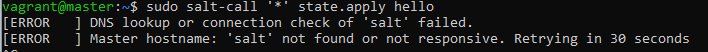
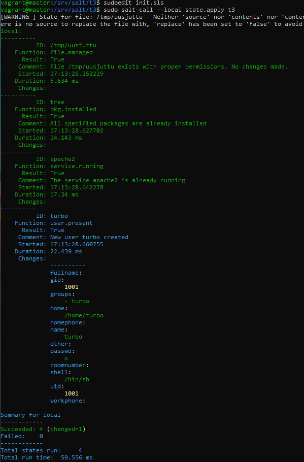

# h3 Infraa Koodina

Tämä raportti on kirjoitettu 14.4.2025 klo. 14.30 - 20.50 välisenä aikana.

Raportissa on tehty Tero Karvisen Palvelinten Hallinta kurrsin tehtäviä, jotka löytyvät materiaaleineen sivustolta: (https://terokarvinen.com/palvelinten-hallinta/)

Käytetty laitteisto:

Isäntäkone:

    Malli: Msi GE75 Raider 10sf
    OS: Windows 10 Home 64-bit
    RAM: 16 GB
    CPU: Intel(R) Core(TM) i7-10750H CPU @ 2.60GHz (12 CPUs), ~2.6GHz
    GPU: NVIDIA GeForce RTX 2070
    BIOS: E17E9IMS, 10A

## x) Tiiviste

### Hello Salt Infra-as-Code

* Saltilla voit hallita tuhansia koneita.

Saltin-asennus

* $ sudo apt-get update
* $ sudo apt-get -y install salt-minion/master

Moduuli

* $ sudo mkdir -p /srv/salt/hello/ - "/hello/" on moduuli mitä käytetään.
* $ cd /srv/salt/hello/ - "/srv/salt/" jaetaan orjille.
* $ sudoedit init.sls - Täytyy olla moduulissa mitä halutaan käyttää (tässä tapauksessa se on "/hello/").
* $ sudo salt-call --local state.apply hello - ajaa moduulin "hello"

Micro editor

* $ sudo apt-get -y install micro - asentaa micron
* $ export EDITOR=micro - asettaa micron oletus editoriksi

### Salt Overview

Rules of YAML

* YAML -> Pythoniksi salttia varten
* Data on rakenteellista "avain: arvo" -> "hedelmä: omena"
* CASE-SENSITVE (isolla ja pienellä kirjaimella merkitystä)
* Sisennykset tapahtuvat välilyönnillä (ei saa käyttää TAB-painiketta)
* Kommentit alkavat risuaidalla "#"

YAML simple structure

Scalars, arvo voi olla numero, teksti tai boolean (true/false)

* avain: arvo" -> "hedelmä: omena"

Lists, arvot menevät omille riveille kahden välilyönnin ja väliviivan kanssa. 

    lista_avain:
      - arvo1
      - arvo2

Dictionaries

    kirja_avain:
      avain: arvo   
      lista_avain:
        - arvo1
        - arvo2

Lists and dictionaries - YAML block structures

* YAML on lohkoissa
* Arvot pitää sisentää yhdellä tai useammalla välilyönnillä (2 standardi)
* Listoissa pitää käyttää väliviivaa ja välilyöntiä

## a) Hei infrakoodi

Navigoin komentotulkissa hakemistoon missä aikaisemman tehtävän vagranfile sijaitsee ja käynnistin silloin tekemäni virtuaalikoneet komennolla: "vagrant up".

Kirjaudin master koneelle komennolla "vagrant ssh master" ja tein komennolla "sudo mkdir -p /srv/salt/hello/" kansion "hello" hakemistoon "/srv/salt/". Kansiota "hello" käytetään tässä tehtävässä moduulina. Isäntäkoneelle siksi, että täältä nämä ajot halutaan suorittaa orjille.

Tämän jälkeen navigoin juuri tekemääni hakemistoon "cd /srv/salt/hello/". Asetin micron oletuseditoriksi ja tein init.sls tiedoston komennolla "sudoedit init.sls" Ja lisäsin tänne seuraavat rivit:

    /tmp/hellotimo:
      file.managed
 
Seuraavaksi ajoin tekemääni moduulia lokaalisti komennolla "sudo salt-call --local state.apply hello".

Homma näyttäisi toimivan. Eli "/tmp/" hakemistoon tehtiin tiedosto nimeltä "hellotimo". Tässä vaiheessa rupesin miettimään, että mitä tapahtuu, jos lisään "init.sls" tiedostoon toisen koodin pätkän.
Lisäsin "init.sls" tiedostoon seuraavat rivit:

    /tmp/shutuptimo:
      file.managed

Ja ajoin taas tämän lokaalisti.

Saltti ei tässä tee muuta, kuin tarkista, että tiedostot "hellotimo" ja "shutuptimo" löytyvät "/tmp/" hakemistosta, jos ei niin tehdään nämä. Yllä näkyy, että on onnistunut yhdellä muutoksella. Muutos on sitten tämä "shutuptimo" tiedoston luonti.

## b) Aja esimerkki sls-tiedostosi verkon yli

Nyt pitikin sitten ajaa äskeinen moduuli orjille. Tarkistetaan yhtys orjiin komennolla "sudo salt '*' test.ping"

Yhteys näyttäisi pelaavan. Seuraavaksi kokeilin ajaa "hello" moduulia orjalle. Kokeilin komentoa "sudo salt-call '*' state.apply hello".

Ei toiminut sillä "salt-call" komentoa käytetään, kun ajetaan lokaalisti jotain. Eli tätä komentoa voisin ymmärtääkseni käyttää orjakoneelta käsin hakeakseni tälle yksittäiselle orjakoneelle isäntä koneelta jotain. Esim. tämän "hello" moduulin. (https://docs.saltproject.io/en/latest/ref/cli/salt-call.html)

Uusi yritys komennolla "sudo salt '*' state.apply hello"

Slave001 koneelle on onnistuneesti tapahtunut 2 muutosta. "hellotimo" ja "shutuptimo" tiedostot on tehty. Eli voisin tästä päätellä tämän onnistuneen. Kävin vielä tarkistamassa. Kirjauduin orjakoneelle ja katsoin mitä "/tmp/" hakemistosta löytyy.

Kiltisti on tiedostot asentuneet. Olen siis onnistunut. 

Tässä vaiheessa huomasin, että tämä pitikin ajaa orjalla. Eli olen tämän ajanut masterilta orjalle, mutta minun piti orjalta hakea tämä. Tuhosin siis tiedostot orjalta ja kokeilin. 

Nyt pitäisi tuon "salt-call" pyynnön toimia, eli käytin komentoa 

    sudo salt-call '*' state.apply hello

Ja tämähän meni väärin sillä en suorita pyyntöä kaikille "'*'", vaan haen tavaraa "call" kutsulla isännältä, eli täytyy käyttää komentoa: 
    
    sudo salt-call state.apply hello

Noniin sehän toimi! Ja muutoksia tapahtui, koska tuhosin tiedostot aiemmin.

## c) sls-tiedosto 2 tilafunktiolla

Kirjauduin isäntäkoneelle. Tein uuden moduulin "t3" ja tänne init.sls tiedoston. Kokeilin tilamuuttujia "file, pkg, service ja user" siten, että aloitin filestä ja lisäsin aina yhden tilamuuttujan sls tiedostoon, kun sain aikaisemman tilamuuttujan toimimaan.

Eli ajoin salttia lokaalisti suorittaen "t3" moduulia, kun sinne uutta lisäsin. 

Kuten kuvassa näkyy, niin 3 onnistumista ilman muutoksia ja 1 muutosten kanssa. Eli moduuli tekee tiedoston nimeltä "uusjuttu", asentaa paketin "tree", käynnistää apachen sekä tekee käyttäjän nimeltä turbo.

Ajoin vielä komennon "sudo salt '*' state.apply t3" muutaman kerran nähdääkseni, että tämä myös toimii orjille.

(Komennolla "sudo sal 'slave001" state.apply t3" ajettaisiin moduuli vain koneella "slave001", jos jostain syystä haluaa vain yhdelle koneelle muutoksia tehdä.)

Näyttäisi toimivan, kun mikään ei enään muutu. 

## Lähteet:

T. Karvinen 2014: Hello Salt Infra-as-Code. Luettavissa: (https://terokarvinen.com/2024/hello-salt-infra-as-code/) Luettu 14.4.2025

Salt Project: Salt overview. Luettavissa: (https://docs.saltproject.io/salt/user-guide/en/latest/topics/overview.html#rules-of-yaml) Luettu 14.4.2025

Salt Project: Salt-call. Luettavissa: (https://docs.saltproject.io/en/latest/ref/cli/salt-call.html) Luettu 14.4.2025

Salt Project: How Do I Use Salt States?. Luettavissa: (https://docs.saltproject.io/en/latest/topics/tutorials/starting_states.html) Luettu 14.4.2025

Salt Project: salt.states.pkg Luettavissa: (https://docs.saltproject.io/en/latest/ref/states/all/salt.states.pkg.html) Luettu 14.4.2025

