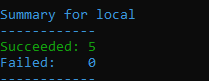
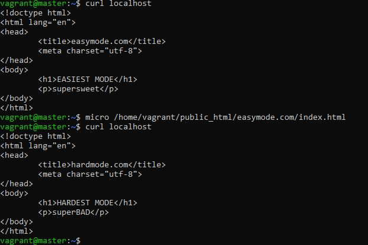
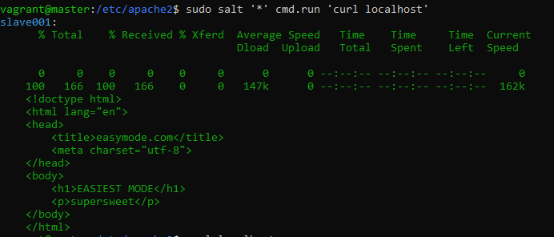
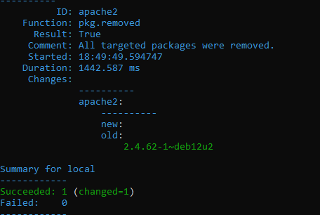
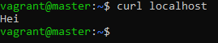

# h4_Pkg_file_service

Tämä raportti on kirjoitettu 21.4.2025 - 22.4.2025 klo. 15.30 - 00.30 välisenä aikana.

Raportissa on tehty Tero Karvisen Palvelinten Hallinta kurrsin tehtäviä, jotka löytyvät materiaaleineen sivustolta: (https://terokarvinen.com/palvelinten-hallinta/)

Käytetty laitteisto:

Isäntäkone:

Malli: Msi GE75 Raider 10sf
OS: Windows 10 Home 64-bit
RAM: 16 GB
CPU: Intel(R) Core(TM) i7-10750H CPU @ 2.60GHz (12 CPUs), ~2.6GHz
GPU: NVIDIA GeForce RTX 2070
BIOS: E17E9IMS, 10A

## x) Tiivistelmä

### Karvinen 2018: [Pkg-File-Service – Control Daemons with Salt – Change SSH Server Port](https://terokarvinen.com/2018/04/03/pkg-file-service-control-daemons-with-salt-change-ssh-server-port/?fromSearch=karvinen%20salt%20ssh)

SSH-tilan tekeminen:
    
    openssh-server:
      pkg.installed
        /etc/ssh/sshd_config:
    file.managed:
      - source: salt://sshd_config
    sshd:
      service.running:
        - watch:
        - file: /etc/ssh/sshd_config

     $ cat /srv/salt/sshd_config

sshd.config tiedoston asetukset:

    # DON'T EDIT - managed file, changes will be overwritten
    Port 8888
    Protocol 2
    HostKey /etc/ssh/ssh_host_rsa_key
    HostKey /etc/ssh/ssh_host_dsa_key
    HostKey /etc/ssh/ssh_host_ecdsa_key
    HostKey /etc/ssh/ssh_host_ed25519_key
    UsePrivilegeSeparation yes
    KeyRegenerationInterval 3600
    ServerKeyBits 1024
    SyslogFacility AUTH
    LogLevel INFO
    LoginGraceTime 120
    PermitRootLogin prohibit-password
    StrictModes yes
    RSAAuthentication yes
    PubkeyAuthentication yes
    IgnoreRhosts yes
    RhostsRSAAuthentication no
    HostbasedAuthentication no
    PermitEmptyPasswords no
    ChallengeResponseAuthentication no
    X11Forwarding yes
    X11DisplayOffset 10
    PrintMotd no
    PrintLastLog yes
    TCPKeepAlive yes
    AcceptEnv LANG LC_*
    Subsystem sftp /usr/lib/openssh/sftp-server
    UsePAM yes
 
Yhteyden testaus:

    $ nc -vz tero.example.com 8888

## a & c) Asenna Apache, korvaa sen testisivu ja varmista, että demoni käynnistyy.

Aloitin tekemällä käsin .conf tiedoston "/etc/apache2/sites-available/" hakemistoon. Deaktivoin default sivun ja aktivoin tekemäni uuden sivun. Tämän jälkeen tein public_sites hakemiston "/home/vagrant/" hakemistoon.

poistin apache2 käyttäen salttia komennolla: 

    sudo salt-call --local -l info state.single pkg.removed apache2

Tämän jälkeen vielä poistin "public_html" hakemiston komennolla:

    sudo rm -r /home/vagrant/public_html/

Seuraavaksi tein uuden moduulin nimeltä "easymode" hakemistoon "/srv/salt/" komennolla:

    sudo mkdir -p /srv/salt/easymode/

Navigoin tänne ja tein "init.sls" tiedoston komennolla:

    sudoedit init.sls

Tätä rupesin sitten rakentelemaan seuraavanlaiseksi:

    install&run_apache2:
      pkg.installed:
        - name: apache2
      service.running:
        - name: apache2
        - watch:
          - file: /etc/apache2/sites-available/000-default.conf
          
    easymode_conf:
      file.managed:
        - name: /etc/apache2/sites-available/000-default.conf
        - source: salt://easymode/files/easymode.conf
    
    create_easymode:
      file.directory:
        - name: /home/vagrant/public_html/easymode.com/
        - user: vagrant
        - group: vagrant
        - makedirs: True         
    
    handle_html: 
      file.managed:
        - name: /home/vagrant/public_html/easymode.com/index.html
        - source: salt://easymode/files/index.html
        - user: vagrant
        - group: vagrant

Tein sls tiedostoa tehdessä "easymode" moduulin sisälle files hakemiston. Tänne lisäsin tiedostot index.html ja easymode.conf.

Eli tekemäni sls tiedosto toimii seuraavasti:

* install&run_apache2 = Asentaa apachen, käynnistää tämän ja uudelleenkäynnistää apachen, kun tiedostoa 000-default.conf muokataan (apachen oletuksena päällä oleva .conf tiedosto)
* easymodee_conf = name: tiedosto, jota muokataan. source: millä tiedostolla muokkaus tapahtuu. Eli minun koodissa easymode.conf korvaa 000-default.conf tiedoston sisällön.
* create_easymode = file.directory on keino tehdä hakemistoja. -makedirs = True teke hakemistot, jos näitä ei ole. User ja Group määrittää oikeuksia.
* handle_html = tekee tiedoston index.html ja korvaa tämän sisällön sourcesta tulevalla sisällöllä.

index.html näyttää seuraavalta:

    <!doctype html>
    <html lang="en">
    <head>
        <title>easymode.com</title>
        <meta charset="utf-8">
    </head>
    <body>
        <h1>EASIEST MODE</h1>
        
supersweet

    </body>
    </html>

easymode.conf seuraavalta:

    <VirtualHost *:80>
        ServerName www.easymode.com
        ServerAlias easymode.com
        DocumentRoot /home/vagrant/public_html/easymode.com
    </VirtualHost>
        <Directory /home/vagrant/public_html/easymode.com>
        Require all granted
    </Directory>   
        
Nämä ovat siis .sls tiedostossa olevat source tiedostot, mitkä saltilla sitten asentuvat.

easymode moduulin ajoin komennolla: 

    sudo salt-call --local state.apply easymode

Kuten näkyy, niin kaikki ovat onnistuneesti asentuneet. (muutoksia ei tapahdu, kun olen ajanut tämän muutaamaan otteeseen)

Koska tein näköjään tässä samalla c tehtävää, niin näytän nyt vielä, että käyttäjänä voi localhostissa pyörivää sivua muokata ilman sudo oikeuksia. 

Ajetaan nyt vielä orjalle ja katsotaan mitä tapahtuu.

4 muutosta ja 1 onnistuminen (apache2 asennettu entuudestaan koneelle). Seuraavaksi tarkistin, että oletussivu vaihtunut orjalla.

Näin näyttäisi käyneen, eli minun käsittääkseni tämä nyt toimii. Orja siis käyttää moduulin sisällä olevaa index.html, mitä ei ole muokattu. Tästä syystä orjalla näkyy "vanha" index.html.

Tässä tehtvässä olisi varmaan riittänyt, jos olisi käyttänyt Karvisen vinkeistä löytyvää komentoa:

    echo "Hei"|sudo tee /var/www/html/index.html

Tämä olisi muokannut apache2 oletussivun näyttämään tekstin "Hei", mikä olisi riittänyt apache2 korvaamisessa. Koska en tajunnut ottaa kuvia, kun hihat olivat tyhjät, niin tein nyt tämän vielä. Eli poistetaan kaikki.

Eli nyt ei ole apachea eikä public_html hakemistoa sisältöineen. Käytin vielä tässä komentoa:

    sudo apt-get purge apache2

Koska conffi tiedostot olivat jääneet ja halusin poistaa kaikki apache2:n conffi tiedostot. Sitten asensin apachen:

    sudo apt-get install -y apache2 

Curlilla localhost

Apachen oletus sivun lataa. Seuraavaksi käytin vinkkiosion komentoa "echo "Hei"|sudo tee /var/www/html/index.html". Ja curlilla tarkistin tuloksen.

Eli apach2 asennettuna käsin ja etusivu vaihdettu. Sitten automaatio, eli ajan tekemäni easymode moduulin.

Ja automaatio toimii.

## b) SSHouto. Lisää uusi portti, jossa SSHd kuuntelee.

## Lähteet: 

T. Karvinen 2025: Palvelinten Hallinta. Luettavissa: (https://terokarvinen.com/palvelinten-hallinta/) Luettu 21.4.2025

T. Karvinen 2018: Palvelinten Hallinta. Luettavissa: (https://terokarvinen.com/2018/04/03/pkg-file-service-control-daemons-with-salt-change-ssh-server-port/?fromSearch=karvinen%20salt%20ssh) Luettu 21.4.2025

Salt Project: Salt States. Luettavissa: (https://docs.saltproject.io/salt/user-guide/en/latest/topics/states.html) Luettu 21.4.2025

Ask Ubuntu 2012: Viestiketjun vastaaja M. Waidyanatha, Permanently Removing apache2 Luettavissa: (https://askubuntu.com/questions/176964/permanently-removing-apache2) Luettu 21.4.2025
