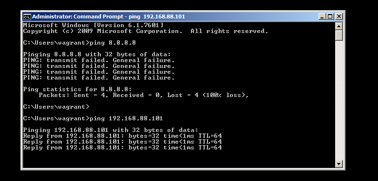

# h5 Miniprojekti - penlab debianilla ja metasploit3:lla

## Huom tässä raportissa esiteltyjä työkaluja ei saa käyttää väärin. Eli ulkopuolisiin verkkoihin/laitteisiin ei saa kajota.

Miniprojektina on pentesting labra debianille. Tarkoituksena on vagrantilla tehdä debian kone, jolla voi harjoitella hyökkäämistä maalikoneeseen mihin on asennettu metasploitable3.

## Attax moduulin rakennus ja pieni demo

Aloitin tekemällä moduulin, mikä asentaa hyökkäämiseen soveltuvia ohjelmia. Tein tälle init.sls oman [repon](https://github.com/veitim/miniprojekti/blob/main/init.sls), jonka haen vagranfilellä konetta alustaessa. 

Kuvassa näkyy moduuli:

* ffuf - fuzzaus työkalu (dokumentaatio: https://github.com/ffuf/ffuf) (HUOM. tällä työkalulla voi aiheuttaa haittaa ulkopuolisille palveluille. Näin ei saa tehdä)
* nmap - työkalu porttiskannausta varten (dokumentaatio: https://nmap.org/docs.html) (HUOM. työkalua väärin käyttämällä voi joutua oikeuteen. Eli skannaa vain harjoitusalustoja siten, ettei paketit pääse vahingossakaan ulos omasta verkosta)
   
* hashid - Kertoo minkä tyyppinen hashi on kyseessä
* hashcat - salasanan murtamista (dokumentaatio: https://hashcat.net/wiki/doku.php?id=hashcat)
* bash-completion - john the ripperin vaatimus. "make" komento käyttää tätä
* git - john the ripperin asentamista varten.
* build-essential - john the ripperin vaatimus
* libssl-dev - john the ripperin vaatimus
* zlib1g - john the ripperin vaatimus
* zlib1g-dev - john the ripperin vaatimus
* libbz2-1.0 - john the ripperin vaatimus
* libbz2-dev - john the ripperin vaatimus
* atool - john the ripperin vaatimus
* zip - john the ripperin vaatimus
* wget - john the ripperin vaatimus
* Loput on sitten john the ripperin asentelua. Alkuun tehdään hakemisto john the ripperille. Tämän jälkeen asennetaan tämä hakemalla se tekijän github reposta. (johnin dokumentaatio: https://github.com/openwall/john)

Moduuli "attax" suoritetaan komennolla:

    sudo salt-call --local state.apply attax

Tämä täytyy tehdä kolme kertaa, jotta saavutetaan idempotentti tila.

Pieni demo johh the ripperistä:

Navigoidaan seuraavaan hakemistoon ja ajetaan komento "./configure"

Tämän jälkeen suoritetaan seuraavassa kuvassa näkyvä "make" komento

    make -s clean && make -sj2" 

Työkaluvalmiina käytettäväksi

Jokunen työkalu millä tehdä ikävyyksiä.

Seuraavaksi tehdään tiedosto, joka zipataan ja salasanalla suojataan.

Kokeillaan unzipata tämä

Ei onnistu, eikun murtamaan.

Eli john the ripprein sisällä on "run" kansio, jonka sisältä voi "./työkalu" komennolla työkaluja ajaa. Käytän kuvassa zip2john työkalua, jolla saan hashin zipistä. Ja sitten "john" työkalulla puran tämän hashin ja vastauksena näkyykin zipille annettu salasana, jolla tämän voi purkaa.

John the ripper esitelty.

Seuraavaksi ajoin moduulin init.sls tiedoston githubiin, josta pystyn tämän tulevaisuudessa hakemaan.

## Vagrantfile

Seuraavaksi vagrantfilen vuoro (löytyy täältä: https://github.com/veitim/miniprojekti/blob/main/vagrantfile). Ja se näyttää seuraavalta: 

* haetaan päivitykset
* asennetaan curli
* haetaan salttia varten paketteja
* päivitetään paketit (saltti vaati tätä)
* asennetaan tulimuuri
* avataan portteja (22/tcp tärkeä, koska vagrantilla ollaan yhteydessä ssh:n kautta)
* portit 4505 ja 4506 tärkeitä, jos on orjia. Saltti taitaa toimia näiden kautta (eli minun projektissa näitä ei tarvitsisi pitää auki)
* asennetaan salt-master
* tehdään moduuli hakemisto
* haetaan reposta init.sls
* käynnistetään saltti
* potkaistaan salttia
* laitetaan tulimuuri päälle

  Siinä alkuasetukset. Sitten onkin debian koneen ja metasploitable3 koneen alustus. Koneille annetaan 2gb työmuistia (ettei vahingossa kaatuisi)

  komentotulkista komennolla:

      vagrant up

  Käynnistetaan/asennetaan koneet.

## Metasploitable3

Metasploitable on tarkoituksella tehty haavoittuvaiseksi koneeksi. Joten tätä konetta ei kannata missään tapauksessa päästää julkiseen verkkoon. Mieluiten tätä käytetään siten, että ainoastaan hyökkääjä koneella on tähän yhteys. Ongelmana tässä on se, että tein tämän vagrantilla ja vagrant käyttää "NAT" yhteyttä. Ja tätä yhteyttä käyttämällä pääsee julkiseen verkkoon, niin en keskinyt parempaa keinoa sulkea tätä, kuin manuaalisesti.

Nappasin "NAT" verkon pois käytöstä network asetuksista (adapter1).

Seuraavaksi aika kirjautua tähän koneeseen sisälle "ctrl + alt + del" Pystyy yläpalkin "insert" valikosta tämän tekemään.

Sitten kirjaudutaan vagrant tilille (vagrant/vagrant) Kaikkiin prompteihin vastataan ei "Eli ei käynnistetä laittea uudesatan tai yritetä päivittää tätä". Sitten tarkistetaan yhteys hyökkäys koneeseen ja verkkoon.

Ja näin nyt on metasploitable3 valmiina ottamaan hyökkäyksiä vastaan.

Kun NAT yhteys on käytössä hyökkäys koneella (toimii vagrantin kautta), niin voidaan sulkea verkko kokonaan isäntäkoneesta. Tai säädetään palomuuriasetuksia.

Itse olin laiska ja suljin verkon testailujen ajaksi. Mutta komennoilla:

    sudo ufw default deny outgoing
    sudo ufw allow out on eth1 to 192.168.88.102
    sudo ufw allow in on eth1 from 192.168.88.102

Pitäisi saada palomuuri blokkaamaan lähtevä liikenne muihin osoitteisiin. Osoite 192.168.88.102 on metasploit koneen osoite josta sallitaan ja mihin sallitaan yhteys.

Porttiskannau nmapilla

Portteja näyttäisi olevan auki ja katsotaan tarkemmin ssh porttia

OpenSSH Versio 7.1 Sivuston (https://www.cvedetails.com/version/1295231/Openbsd-Openssh-7.1.html) mukaan löytyy seuraavia haavoittuvaisuuksia.

Tähän on aika lopettaa!

Kun halutaan laitteet sammuttaa, niin itse kävin laittamassa "NAT" verkon täpän päälle metasploitista, jotta "vagrant" komennot toimisivat "halt, destroy jne."

## Lähteet:

T. Karvinen 2025: Palvelinten Hallinta. Luettavissa: (https://terokarvinen.com/palvelinten-hallinta/) Luettu 6.5.2025

T. Karvinen 2025: Tunkeutumistestaus. Luettavissa: (https://terokarvinen.com/tunkeutumistestaus/) Luettu 6.5.2025

T. Karvinen 2023: Salt Vagrant - automatically provision one master and two slaves (https://terokarvinen.com/2023/salt-vagrant/#infra-as-code---your-wishes-as-a-text-file) Luettu 6.5.2025

T. Karvinen 2023: Crack File Password With John. Luettavissa: (https://terokarvinen.com/2023/crack-file-password-with-john/) Luettu 6.5.2025

T. Karvinen 2022: Cracking Passwords with Hashcat. Luettavissa: (https://terokarvinen.com/2022/cracking-passwords-with-hashcat/) Luettu 6.5.2025

Hashi Corp: rapid7/metasploitable3-win2k8. Luettavissa: (https://portal.cloud.hashicorp.com/vagrant/discover/rapid7/metasploitable3-win2k8) Luettu 6.5.2025

Salt Project: How Do I Use Salt States?: Luettavissa: (https://docs.saltproject.io/en/latest/topics/tutorials/starting_states.html) Luettu 6.5.2025

I. Das 2023: Youtube video: Metasploitable 3 Win2k8 Installation Guide with Windows PowerShell, Vagrantfile and Vagrant Cloud: Katsottavissa: (https://www.youtube.com/watch?v=5MaIR-2ND7o) Katsottu 6.5.2025

T. Veijalainen 2025: (Tero Karvisen kurssitoteutus) Tunkeutumistestaus raportit. Luettavissa: (https://github.com/veitim/tunkeutumistestaus) Luettu 6.5.2025

CVEdetail.com: Open bsd Open SSH 7.1. Luettavissa: (https://www.cvedetails.com/version/1295231/Openbsd-Openssh-7.1.html) Luettu 6.5.2025
